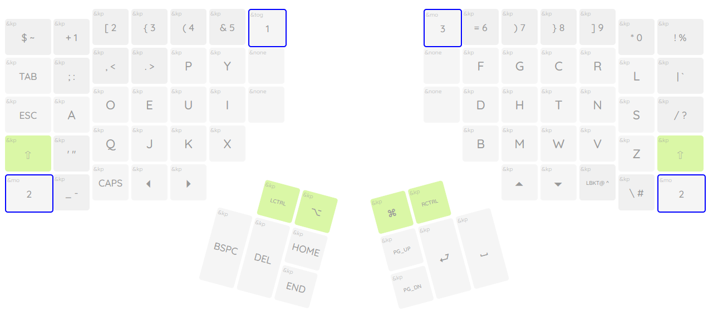
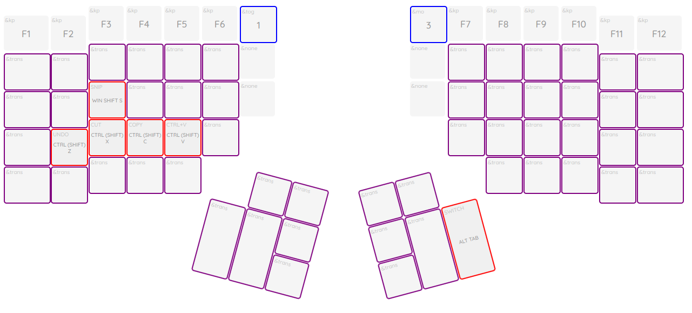

### "Real Programmer's DVORAK" layout programmed for the Advantage 360 (non-pro).

The Smartset application is pretty rough, and the firmware is limited; so I used macros where needed to get the layout working.
Please not the change of the [-_] placement to maintain the arrow keys, for now.

I added support for copy, paste, cut, undo, switch (alt-tab) and snip (win/cmd+shift+s). Using SHIFT + any of these macros is also defined to work as expected (FN+SHIFT+Z = Redo, etc).
I have a Mac version I am dialing in as well, and a linux version intended for use with i3.

To use, rename the layout_{OS}.txt file to a layout and place it on your adv360's v-drive, overwriting the layout you want to replace. Make sure to refresh the adv360 afterwards.

This layout shown on adv360 (only using the ZMK gui for visual layout, this repo does NOT include files for ZMK)

FN1 Layer with common macros

ThePrimeagen's original map

All credit to ThePrimeagen for the layout and standard kb map images.
Original Layout: [ThePrimeagen/keyboards](https://github.com/ThePrimeagen/keyboards)
