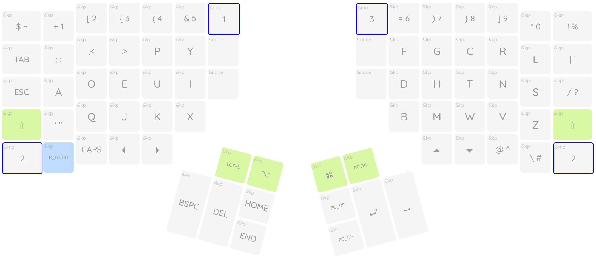
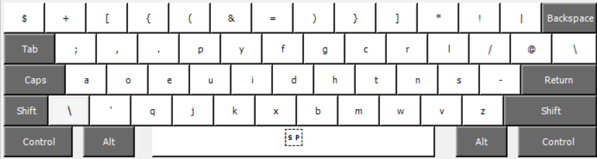
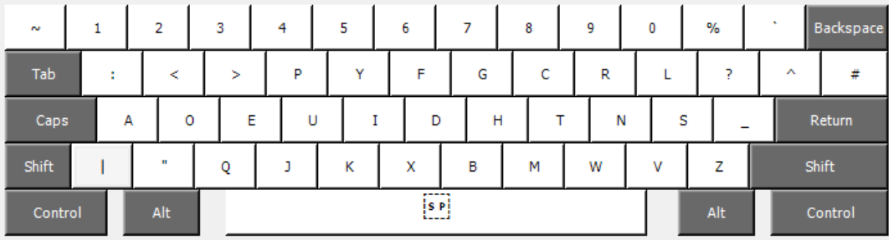

### Real Programmer's DVORAK" layout programmed for the Advantage 360 (non-pro).

The Smartset application is pretty rough, and the firmware is limited; so I used macros where needed to get the layout working.

This layout shown on adv360 (only using the ZMK gui for visual layout, this repo does NOT include files for ZMK)

ThePrimeagen's original map

All credit to ThePrimeagen for the layout and standard kb map images.
Original Repo: [ThePrimeagen/keyboards](https://github.com/ThePrimeagen/keyboards)